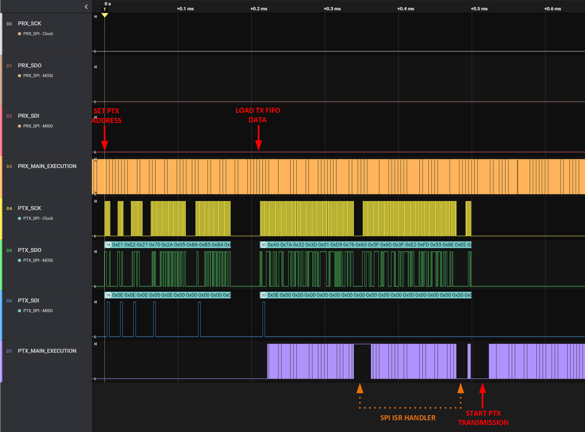

# 📘 Introduction to PIC32-nRF24L01-Driver

   

This project offers a low-level API that facilitates interfacing between a microcontroller-based target and the external nRF24L01 transmitter integrated circuit. Despite being developed with the PIC32MX microcontroller and utilizing MPLAB X IDE alongside the XC32 compiler, this nRF24L01 driver is adaptable to various other microcontroller-based environments.

# :bookmark_tabs: Table of Contents

- [Introduction to PIC32-nRF24L01-Driver](#-introduction-to-pic32-nrf24l01-driver)
- [Table of Contents](#bookmark_tabs-table-of-contents)
- [Understanding nRF24L01](#-understanding-nrf24l01)
- [Features of the Driver](#-features-of-the-driver)
- [Setting Up Your Environment](#️-setting-up-your-environment)
  - [Hardware Requirements and Setup](#hardware-requirements-and-setup)
  - [Software and Build Process](#software-and-build-process)
  - [Emulating the Microcontroller](#emulating-the-microcontroller)
- [Dependencies and Prerequisites](#-dependencies-and-prerequisites)
- [API Documentation and Usage](#-api-documentation-and-usage)
  - [Macro Definitions](#macro-definitions)
  - [Data Types and Structures](#data-types-and-structures)
  - [Driver Functions](#driver-functions)
- [Hands-on Examples](#️-hands-on-examples)
  - [Example: Single Packet Transmission and Reception](#example-single-packet-transmission-and-reception)
- [Future Development](#-future-development)
- [Getting in Touch and Contributions](#-getting-in-touch-and-contributions)
- [License and Usage Terms](#️-license-and-usage-terms)

# 📡 Understanding nRF24L01

The nRF24L01 is a compact wireless transceiver operating on the 2.4 GHz ISM band, produced by Nordic Semiconductor, and is renowned for its high efficiency and versatility. It supports adjustable data rates of 250 kbps, 1 Mbps, and 2 Mbps, catering to a variety of application requirements. The module excels in handling robust data traffic, thanks to its Enhanced ShockBurst™ feature, which automates packet assembly and disassembly, and includes built-in error checking and retransmission of lost packets.

<div align="center">

<a id="fig1"></a>


**Figure 1**: nRF24L01 Block Diagram.<br>
<small>Source: Nordic Semiconductors</small>

</div>

Its unique MultiCeiver™ technology enables six data pipes for multi-point communication, thereby enhancing network flexibility. Additionally, its low power consumption and selectable power rates render it ideal for battery-powered devices, ensuring consistent wireless communication across a broad range of applications. The MultiCeiver feature proves particularly beneficial for IoT devices that require wireless communication between multiple sensor systems and a central controller.

<div align="center">

<a id="fig2"></a>


**Figure 2**: nRF24L01 Multiple Transmitters Single Receiver.<br>
<small>Source: https://lastminuteengineers.com</small>

</div>

Enhanced ShockBurst™ is a packet-based data link layer, providing automatic packet assembly and timing, automatic acknowledgment, and retransmissions of packets. It supports dynamic payload lengths up to 32 bytes and automates packet handling, which includes automatic acknowledgment and retransmission. Its primary function is to ensure efficient and secure data traffic management without requiring MCU involvement.

<div align="center">

<a id="fig3"></a>


**Figure 3**: nRF24L01 Multiple Transmitters Single Receiver.<br>
<small>Source: Nordic Semiconductors</small>

</div>

While it is possible to manually trigger specific handling procedures, such as acknowledgment responses after successful reception, this approach introduces additional complexities. Consequently, this project chose to omit this method. Despite this, the Enhanced ShockBurst™ feature offers a level of abstraction to users and manages the transmission process as intended.

# ✨ Features of the Driver

The nRF24L01 driver currently supports:
- Modifying configuration registers for both the receiver (PRX) and transmitter (PTX) based on user-defined operations set via a configuration structure
- Executing polling-based or interrupt-based send and receive data operations for the PTX
- Enabling interrupt-based reception for the PRX, with an optional acknowledgment payload response

# 🛠️ Setting Up Your Environment

The development, testing, and API validation of the nRF24L01 driver utilized the following setup.

### Hardware Requirements and Setup

A module board, as depicted below, served as the primary hardware for this project. The MCU connects directly to this module using jumper wires, eliminating the need for intermediary components:
- `GND` + `VCC` connect to a 3.3V DC power supply
- `MOSI` + `MISO` + `SCK` + `CSN` link to the MCU's SPI port
- `CE` attaches to the MCU's GPIO port, facilitating control over PTX/PRX operations
- `IRQ` is an optional connection that generates a signal upon data arrival in PRX mode

<div align="center">

<a id="fig4"></a>


**Figure 4**: Common nRF24L01 Module Board Layout.<br>
<small>Source: https://lastminuteengineers.com</small>

</div>

One version of this board incorporates a Low Noise Amplifier (LNA) at the input stage and a Power Amplifier (PA) at the output stage, theoretically enabling communication over distances up to 1000 meters in an unobstructed medium. In such scenarios, a BNC-terminated antenna is recommended. For shorter range requirements, a variant without LNA and PA is available, capable of establishing a link over distances up to 100 meters, theoretically.

> [!WARNING]\
> During testing of nRF24L01 board make sure two (or more) boards are sufficiently distanced (cca. at least few centimeters) otherwise PRX's receiver might get over-saturated with PTX's strong signal which prevents the link to be established.

### Software and Build Process

As mentioned earlier, the project development utilized MPLAB X (v6.05), paired with Microchip's XC32 (v4.21) toolchain for building the project. For detailed information on required libraries for using the nRF24L01 driver, please refer to the [Dependencies and Prerequisites](#-dependencies-and-prerequisites) section.

### Emulating the Microcontroller

Microchip's PicKit4 served as the emulator and debugger for this project, offering a cost-effective solution for successful debugging and code uploading from MPLAB X IDE to the target MCU. The specific MCU used was the PIC32MX170F256B, accompanied by its essential external components.

# 📚 Dependencies and Prerequisites

[Figure 5](#fig5) illustrates the dependencies of the nRF24L01 driver. <span style="color: #009999;">Green blocks</span> represent MCU peripheral drivers, primarily utilized for Serial Peripheral Interface (SPI) communication between the MCU and the nRF24L01 external device, indicated by the <span style="color: #FF6666;">red block</span>. A timer serves as an additional feature, providing a safety mechanism in case of lost connectivity between devices. The required MCU drivers for the PIC32MX device, used for the development and testing of this driver, were custom-developed and are accessible in a separate [repository](https://github.com/lgacnik/PIC32MX-Peripheral-Libs).

<div align="center">

<a id="fig5"></a>


**Figure 5**: nRF24L01 Driver Dependencies.<br>

</div>

Besides the main nRF24L01 driver dependencies there are other dependencies such as:
- Standard Libraries
- XC32 compiler libraries: `xc.h`, `cp0defs.h`, and `attribs.h`
- Register access header files (denoted as `xxx_sfr.h`)

Compiler libraries are mainly used for interrupt handler semantics, interrupt control, and accessing coprocessor registers *CP0* for some specialized tasks.

> [!NOTE]\
> It should be mentioned that the necessary startup file <code>.s</code>, linker file <code>.ld</code> (or <code>.sct</code> for ARM compilers), and MCU configuration bits (aka. fuses) are not provided in this project as these are toolchain and platform specifics and should be handled by the user.

# 📖 API Documentation and Usage

This section offers a brief introduction to the nRF24L01 API. For comprehensive details, please refer to the [nRF24L01_API_doc](nRF24L01_API_doc.pdf). It's important to note that the `nRF24L01.c` source file is thoroughly annotated with quality comment blocks for your convenience.

### Macro Definitions

The API employs preprocessor macros to facilitate a certain level of configuration, particularly for interrupt-based operation settings. However, if your preference leans towards polling-based operations, feel free to disregard these macros.

- `NRF_ISR_IPL`, `NRF_ICX_IPL`, and `NRF_ICX_ISL`: These macros set the interrupt priority and sub-priority levels.
- The `INTx_ISR_MACRO` macro (where `x` ranges from 0 to 4): This macro allows for the selection of an External Interrupt vector. It plays a crucial role in interrupt-driven operations for detecting the data ready signal from a device operating in PRX mode. All these macros are aligned with the XC32 compiler settings, specifically in the context of implementing the IRQ (Interrupt Request) handler.

### Data Types and Structures

Note that only `struct` types are outlined here. Other, `enum` types are assumed to be self-explanatory to the reader.

#### `NrfPtxConfig_t`

This configuration structure is vital for setting up the nRF24L01 in PTX (Primary Transmitter) mode. Ensure its use is exclusive to the `NRF_ConfigPtxSfr()` and `NRF_ConfigPtxPayloadStruct()` functions.

#### `NrfPrxConfig_t`

Similarly, this configuration structure is designed for the nRF24L01 in PRX (Primary Receiver) mode, and should be used solely with the `NRF_ConfigPrxSfr()` and `NRF_ConfigPrxPayloadStruct()` functions.

#### `NrfPayloadConfig_t`

This distinct data type encapsulates all payload-relevant data, providing the necessary information for PTX/PRX payload handling processes.

#### `NrfPipeAddr_t`

Objects of this type are necessary for informing devices in PRX mode about the addresses of the distant PTX devices they are configured to communicate with. A single PRX can establish links with up to six PTX devices, as detailed in the introductory section on nRF24L01.

#### `NrfPinConfig_t`

This type represents the physical, non-SPI device pin data required by both PTX and PRX devices. It captures the essential pin configurations for proper device operation.

> [!NOTE]\
> The type <code>SpiSfr_t</code> is not provided as part of nRF24L01 driver. It is a part of PIC32MX MCU <code>Spi.h</code> library which can be accessed via separate <a href="https://github.com/lgacnik/PIC32MX-Peripheral-Libs/tree/main/Spi" target="_blank">repository</a>.

### Driver Functions

#### `NRF_ConfigPtxSfr()`

```cpp
bool NRF_ConfigPtxSfr(const NrfPtxConfig_t ptxConfig);
```

This function sets up the non-SPI pins and tweaks the internal registers of the nRF24L01 for PTX (transmission) operations.

> [!WARNING]\
> Ensure to configure the SPI operation before initiating any PTX operations.

#### `NRF_ConfigPtxPayloadStruct()`

```cpp
NrfPayloadConfig_t NRF_ConfigPtxPayloadStruct(NrfPtxConfig_t ptxConfig);
```

This function converts a PTX configuration struct into a more manageable PTX payload `struct`.

#### `NRF_ConfigPrxPayloadStruct()`

```cpp
NrfPayloadConfig_t NRF_ConfigPrxPayloadStruct(NrfPrxConfig_t prxConfig);
```

This function converts a PRX configuration struct into a more manageable PRX payload `struct`.

#### `NRF_SendReceivePayload()`

```cpp
bool NRF_SendReceivePayload(NrfPayloadConfig_t payldConfig, void *rxPtr, void *txPtr, uint8_t txSize);
```

This function transmits a data packet to a remote PRX and potentially receives ACK data from the PRX in return. The operation is polling-based, meaning the status of the operation is instantly available once the function execution concludes.

#### `NRF_SendPayload()`

```cpp
bool NRF_SendPayload(NrfPayloadConfig_t payldConfig, void *rxPtr, void *txPtr, uint8_t txSize);
```

This function sends a data packet to a remote PRX and potentially receives ACK data from the PRX in return. The operation is interrupt-based, so you can ascertain the current operation status by invoking the `NRF_ReadStatus()` function.

#### `NRF_StoreAckPayload()`

```cpp
bool NRF_StoreAckPayload(NrfPayloadConfig_t payldConfig, NrfRxPipeNo_t pipeNo, void *txPtr, uint8_t txSize);
```

This function stores an ACK (Acknowledgement) payload in the TX FIFO of a PRX device for a specific pipe number. The payload is subsequently transmitted to the PRX as an ACK immediately following the successful reception of a PTX payload.

#### `NRF_StartReception()`

```cpp
bool NRF_StartReception(NrfPayloadConfig_t payldConfig, void *rxPtr);
```

This function initiates the reception process for the PRX device. Being interrupt-based, the current operation status is retrievable via the `NRF_ReadStatus()` function.

#### `NRF_StopReception()`

```cpp
bool NRF_StopReception(NrfPayloadConfig_t payldConfig);
```

This function ceases the reception process in PRX mode.

#### `NRF_FlushRxFifo()`

```cpp
void NRF_FlushRxFifo(NrfPayloadConfig_t payldConfig);
```

This function clears all three levels of the RX FIFO, primarily used in PRX mode to flush out previous ACK payloads.

#### `NRF_IsRxFifoLoading()`

```cpp
bool NRF_IsRxFifoLoading(void);
```

This function checks if the ACK payload has been completely loaded into the RX FIFO. It is mainly applicable in PRX mode.

#### `NRF_ReadPrxPipeAddr()`

```cpp
uint64_t NRF_ReadPrxPipeAddr(void);
```

This function retrieves the pipe address of the most recently received packet, intended for use in PRX mode.

#### `NRF_ReadStatus()`

```cpp
NrfStatusFlag_t NRF_ReadStatus(void);
```

This function returns the status of the latest nRF24L01 operation, whether in PRX or PTX mode.

#### `NRF_SetUserCallback()`

```cpp
NrfStatusFlag_t NRF_SetUserCallback(NrfUserCallback_t cType, void (*fPtr)(void));
```

This function allows you to set a user callback for a particular type of operation.

#### `NRF_ReleaseUserCallback()`

```cpp
NrfStatusFlag_t NRF_ReleaseUserCallback(NrfUserCallback_t cType);
```

This function releases a previously set user callback for a particular type of operation.

# 🖥️ Hands-on Examples

This section showcases how to utilize the API covered in the previous section, providing practical examples. The examples are briefly summarized for demonstration purposes. For comprehensive details, please refer to the [nRF24L01_API_doc](nRF24L01_API_doc.pdf) documentation. Complete code of the examples outlined below can be found in the [examples](examples) folder.

### Example: Single Packet Transmission and Reception

Below is an example of how to configure an nRF24L01 device to operate in PRX (Primary Receiver) mode. Initially, define and set up a PRX configuration structure `prxConfig`. Ensure that the PTX (Primary Transmitter) device, which you will be communicating with, is configured to use one of the six unique user-defined pipe addresses for payload transmission. Optionally, the PRX can be loaded with a response payload. If the `NrfPrxConfig_t::isAck` attribute is set to `false`, the PRX will neither respond with an ACK nor its optionally appended payload (even if it exists in the PRX's RX FIFO).

> [!NOTE]\
> Ensure all PRX pipe addresses are set to a non-zero value (avoiding addresses <code>0x0000000000</code> and <code>0xFFFFFFFFFF</code> for signal integrity reasons). The address <code>NrfPrxConfig_t::pipeAddr::pipe0</code> can be any value, but the first 4 bytes of the addresses for the remaining pipes must be the same, and should match the first 4 bytes of <code>NrfPrxConfig_t::pipeAddr::pipe1</code>. In this example, the common sequence is <code>0xB3B4B5B6</code>, while the last byte of each address is unique. All addresses are 5 bytes in length by default, and all used addresses must be unique. If an address is unused, leave it unconfigured or set to all zeros.

You can monitor the real-time operation status using the `NRF_ReadStatus()` function, polling for status flags of type `NrfStatusFlag_t`. For an immediate response to ISR-based operations, you can configure user-defined callbacks using `NRF_SetUserCallback()` before starting the relevant operation. These callbacks are executed after internal calls are processed.

> [!WARNING]\
> Ensure that user-defined callbacks executed within an ISR are kept as brief as possible to avoid potential issues.

```cpp
int main(void) {
  /* Refer to the 'nRF24L01_API_doc.pdf' documentation examples for full code */

  /* PRX configuration structure */
  NrfPrxConfig_t prxConfig = {
    .spiSfr = &PRX_SPI_MODULE,
    .isAck = true,
    .dataRate = NRF_RF_DR_2000,
    .rfChannel = NRF_RF_CH_2,
    .pipeAddr = {
        .pipe0 = 0x7878787878,
        .pipe1 = 0xB3B4B5B6F1,
        .pipe2 = 0xB3B4B5B6CD,
        .pipe3 = 0xB3B4B5B6A3,
        .pipe4 = 0xB3B4B5B60F,
        .pipe5 = 0xB3B4B5B605
    },
    .pinConfig = {
        .cePin = PRX_CE,
        .csPin = PRX_CS,
        .irqPin = PRX_IRQ
    }
  };

  /* Configure the device as a PRX */
  NRF_ConfigPrxSfr(prxConfig);

  /* Configure payload structure */
  NrfPayloadConfig_t prxPayloadConfig = NRF_ConfigPrxPayloadStruct(prxConfig);

  /* Set user callback */
  NRF_SetUserCallback(NRF_CLBK_RX_PAYLOAD_RECEIVE, RxCallback);

  /* Store ACK payload */
  uint8_t prxTxData[3];
  prxTxData[0] = 0x12;
  prxTxData[1] = 0x23;
  prxTxData[2] = 0x45;
  NRF_StoreAckPayload(prxPayloadConfig, NRF_RX_PIPE_5, prxTxData, 3);

  /* Main program execution */
  while (NRF_IsRxFifoLoading())
  {
    /* Do other application-related tasks meanwhile */
  }

  /* Start reception */
  NRF_StartReception(prxPayloadConfig, prxRxData);

  /* Main program execution */
  while (1)
  {
    /* Do other application-related tasks meanwhile */
    /* When payload is received the 'RxCallback' is called from
     * internal ISR handler */
  }

  return 0;
}

void RxCallback(void)
{
  /* Toggle a pin or handle some data */
}
```

Code for configuring an nRF24L01 device as a PTX (Primary Transmitter) is outlined below. Start by initializing a PTX configuration structure `ptxConfig`. Ensure that the corresponding PRX (Primary Receiver) device has the address used for PTX payload transmission set as one of its six available pipe addresses. In this example, the PTX operates in a polling-based manner. Alternatively, you could utilize the `NRF_SendPayload()` function combined with either polling-based status checks via `NRF_ReadStatus()` or an ISR-based immediate response through a previously set user callback, aiming to reduce CPU overhead.

```cpp
/* Unique address used to establish link with distant PRX */
#define PRX_ADDR        (0xB3B4B5B605)

int main(void) {
  /* Refer to the 'nRF24L01_API_doc.pdf' documentation examples for full code */

  /* PTX configuration structure */
    NrfPtxConfig_t ptxConfig = {
      .spiSfr = &PTX_SPI_MODULE,
      .isAck = true,
      .retrDelay = NRF_ARD_1000,
      .retrCount = NRF_ARC_15,
      .rfChannel = NRF_RF_CH_2,
      .rfPower = NRF_RF_PWR_MIN,
      .dataRate = NRF_RF_DR_2000,
      .pinConfig = {
          .cePin = PTX_CE,
          .csPin = PTX_CS,
          .irqPin = PTX_IRQ
      }
  };

  /* Configure the device as a PTX */
  NRF_ConfigPtxSfr(ptxConfig);
  
  /* Configure payload structure */
  NrfPayloadConfig_t ptxPayloadConfig = NRF_ConfigPtxPayloadStruct(ptxConfig, PRX_ADDR);
  
  uint8_t txData[] = {0x5A, 0x32, 0x3D, 0x01, 0xD9, 0x56, 0x43, 0x5F,
                      0x4D, 0x3F, 0xE2, 0xFD, 0x55, 0x8E, 0xEE, 0xE7,
                      0x90, 0xFC, 0x57, 0xE1, 0xE8, 0x4C, 0xFD, 0xAC,
                      0x04, 0xAE, 0x45, 0xF5, 0xD3, 0x41, 0x20, 0x0D};

  /* Send data and wait for ACK payload */
  uint8_t ptxRxData[3];
  NRF_SendReceivePayload(ptxPayloadConfig, ptxRxData, tempTxData, sizeof(tempTxData));
  
  while(1)
  {
    /* Do other application-related tasks afterwards */
  }

  return 0;
}
```

Should the PRX have its RX FIFO loaded for the associated pipe address, it will respond with payload data upon successful payload receipt from the PTX. If ACK is enabled on the PTX, it will await an ACK response from the PRX device (in a polling-based manner). The received ACK response may or may not include appended payload data. Therefore, it is crucial to ensure that both the PRX and PTX devices have their `isAck` attribute values synchronized in their respective configuration structures.

#

The figures below provide a visual representation of sample measurement data taken from the demonstrative example code mentioned above, with both sides utilizing ISR-based operation. The measurements were conducted using a [Logic8](https://www.saleae.com) logic analyzer, an invaluable tool for monitoring protocol data traffic. [Figure 6](#fig6) illustrates the initial phase of operation, showcasing the transmission from the PTX device. Conversely, [Figure 7](#fig7) highlights the reception at the PRX device's side.

<div align="center">

<a id="fig6"></a>


**Figure 6**: PTX Operation Time Diagram.<br>

</div>

<div align="center">

<a id="fig7"></a>


**Figure 7**: PRX Operation Time Diagram.<br>

</div>

</div>

Pay close attention to the `PTX_MAIN_EXECUTION` and `PRX_MAIN_EXECUTION` toggling signals. These signals track the availability of CPU cycles for user-defined application code execution (a *toggle* indicates available app cycles, while *no toggle* indicates internal ISR callback cycles). Each break in application execution is marked and annotated to indicate the operation that commenced at that particular point in time. With polling-based operations, the PTX application code would only resume execution after the complete transfer has concluded.

The operation concluded in under 1.2 ms, under the following test specifications:
- MCU internal oscillator frequency: 40 MHz
- SPI serial clock frequency: 10 MHz, with 8-bit wide data
- PTX TX payload size: 32 bytes
- PRX TX ACK payload size: 3 bytes

# 🚀 Future Development

Looking ahead, here are some ideas for the continued development of the nRF24L01 driver:
- Implement functions for entering/exiting the various stand-by modes to achieve ultra-low power consumption.
- Refactor the library to support multiple nRF24L01 devices. While this may not be necessary for simple transmissions, it could be crucial for communication with a large number of remote receiver devices, where parallelized transmission would be beneficial.

# 📞 Getting in Touch and Contributions

If you encounter any bugs or have suggestions, please [raise an issue](https://github.com/MucaGinger/PIC32-nRF24L01-Driver/issues). Alternatively, feel free to contact me directly via [email](mailto:lgacnik97@gmail.com) if you're interested in contributing or taking this project to the next level.

# ©️ License and Usage Terms

This project is licensed under the MIT License - see the [LICENCE](LICENCE) file for details.

#

&copy; Luka Gacnik, 2023

<!--
- find symbols here: https://github-emoji-picker.rickstaa.dev
-->
